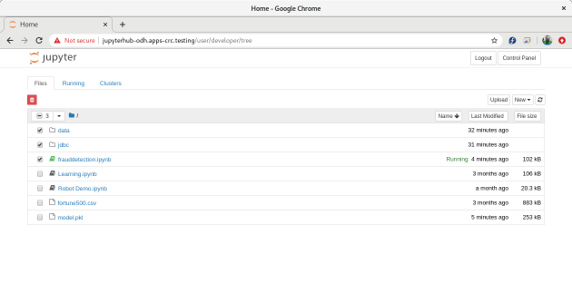
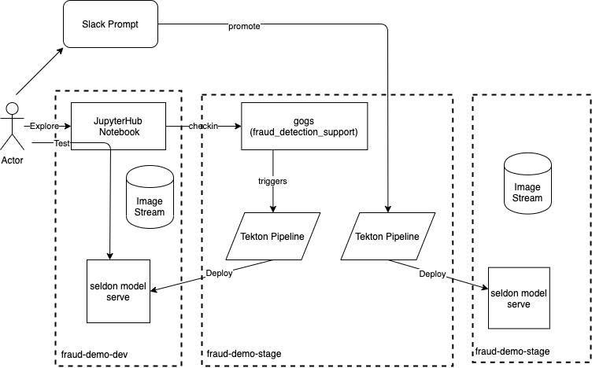

= AI/ML Meets DevOps 
:experimental:
:toc:
:toclevels: 4

== Introduction == 

This project is still in progress. The objective of this project is to illustrate the use of OpenDataHub running on Openshift to run AI/ML workload. OpenDataHub components used in the project include:

* Spache Spark
* Red Hat Data Virtualization
* Jupyterhub
* Seldon
* Kafka
* Rook

=== Repository Structure

This repo is to support the overall demo.  The actual ML assets (e.g. jupyter notebooks) can be found in this repository's link:https://github.com/hatmarch/fraud_detection_support[fraud_detection_support] submodule.  Follow the link for more information about notebooks and data therein.

=== Fraud Detection
The Jupyter notebook uses the Random Forest algorithm to train a model to detect fraud based on the features in the **creditcard.csv** file. It also plots the confusion matrix to analyse how good the fit is.

Your jupyterhub should look like the following screenshot with 'data' and 'jdbc' directories containing the content in the respective directories in the 'notebook' directory.

The notebook will be available on the jupyterhub server that the demo setup script creates.  You can also run the notebook locally by running it within a container based on link:fraud_detection_support/notebook-images/Dockerfile[this Dockerfile] from the link:https://github.com/hatmarch/fraud_detection_support[fraud_detection_support] submodule.

=== Planned Data Sources
Reading CSV file is only the first step. Addition data sources include:
- Apache Spark
- Data Virtualization ie, a virtual database which combines info from a relational database and a CSV file which the Jupyter notebook accesses using JDBC.

== Demo Setup

Here are the instructions for setting up the demo on an OpenShift cluster.  These have been tested with OpenShift v4.4

After running through these steps, you should wind up with a project and service layout like this

To install the demo you must first:

. Provision an OpenShift cluster (version 4.4 or higher)
. Install the <<Demo Prerequisites, Demo Prerequisites>>
. Run the Demo creation script (as outlined in <<Main Demo Setup, Main Demo Setup>>)

[WARNING]
====
Make sure you run the following command before executing any of these commands listed in this demo.

----
. scripts/shell-setup.sh 
----
====

=== Demo Prerequisites

==== OpenShift Pipelines (Tekton) 

Pipeline setup is inspired by this post link:https://developers.redhat.com/blog/2020/02/26/speed-up-maven-builds-in-tekton-pipelines/[here] and the instructions link:https://github.com/openshift/pipelines-tutorial/blob/master/install-operator.md[here]

. Install subscription (in openshift operators)
+
----
oc apply -f $DEMO_HOME/kube/tekton/tekton-subscription.yaml
----
+
. Optionally install tekton dashboard (for visualization) as per link:https://github.com/tektoncd/dashboard[here]
+
----
oc apply -f $DEMO_HOME/kube/tekton/dashboard/openshift-tekton-dashboard-release.yaml
oc wait --for=condition=Available deployment/tekton-dashboard -n openshift-pipelines
----
+
. Then you can open the dashboard by hitting this URL.  It will authenticate using OpenShift oauth
+
----
echo "https://$(oc get route tekton-dashboard -o jsonpath='{.spec.host}' -n openshift-pipelines)/"
----
+
. When the operator has finished installing, it will install a pipeline service account in all projects that have sufficient permissions to build stuff.  There is also a centralized openshift-pipelines project that holds pipeline supporting pods.  
+
NOTE: See also tips and tricks from the link:https://github.com/openshift/pipelines-tutorial[pipelines tutorial]

==== OpenDataHub ====

. Install subscription (in openshift operators)
+ 
----
oc apply -f $DEMO_HOME/kube/odh/odh-subscription.yaml
----
+
. When you run the link:scripts/create-demo.sh[setup script] it will make sure the proper OpenDataHub (odh) elements get installed.

==== Slackbot Setup ====

The CI/CD toolchain that is setup by the link:scripts/create-demo.sh[create demo script] will prompt to slack when a deployment to dev is completed.  In order for this to work, you need to setup a slack bot and obtain a bot specific webhook to be able to post.

TODO: Write slackbot instructions

==== Sysdig Setup ====

Image vulnerability scanning is done using Sysdig inline image scanning.  For the demo to work it requires:

1. That the user have an active Sysdig Secure API token
2. Have either setup the default policy list to match what you would like scanned for the demo, or the (internal) registry has been registered with Sysdig and policies assigned

TODO: Writeup instructions for Sysdig configuration.

=== Main Demo Setup ===

NOTE: This demo is heavily influenced by link:https://medium.com/analytics-vidhya/manage-ml-deployments-like-a-boss-deploy-your-first-ab-test-with-sklearn-kubernetes-and-b10ae0819dfe[this post] which walks through a hello-world of sorts with Seldon

Run the following script to setup the entire cicd project (it will create a project called `<PROJECT_PREFIX>-cicd` (where `<PROJECT_PREFIX>` is the value passed to --project-prefix in the command below) if it doesn't exist already to install all the artifacts into.

Prior to running this script you will need your login details for access.redhat.com to get a private registries and you will also need the webhook url for the Slackbot you setup <<Slackbot Setup,in the prerequisites section>> and an API token for Sysdig Secure as per <<Sysdig Setup, the Sysdig section>>

----
$DEMO_HOME/scripts/create-demo.sh install --project-prefix fraud-demo --user "${USER}" --password "${PASSWORD}" --slack-webhook-url "${SLACK_WEBHOOK_URL}" --sysdig-secure-token "${SYSDIG_SECURE_API_TOKEN}"
----

The `<USER>` and `<PASSWORD>` that is passed in is the user and password needed to create a pull secret for registry.redhat.io.  This is needed for the s2i images.  It will basically associate this secret with the pipelines service account.  NOTE: you can use a redhat registry server account name and password instead of your own login and password

If the script runs without issue you should see the following message indicating the it has completed successfully:

----
Demo elements installed successfully!
----

== Validating Demo Setup ==

If your setup script runs to completion (as seen <<Main Demo Setup, Main Demo Setup>>) then you should be able to validate your setup by doing the following:

. Trigger the pipeline using the following command (must have run the demo setup):
+
----
pr $DEMO_HOME/kube/tekton/pipelinerun/fraud-model-dev-pipeline-run.yaml
----
+
. You should see a Tekton log start to flood the terminal window in which it was initiated
+
. This will eventually fail (expected) on validating the model
+
. Adjust the model accuracy as per <<Adjusting Required Accuracy Threshold, this section>>
+
. Re-run the pipeline
+
----
pr $DEMO_HOME/kube/tekton/pipelinerun/fraud-model-dev-pipeline-run.yaml
----
+
. This time it should complete successfully and deploy the Seldon model to the development project
** If you used the slack webhook, you should see it post to your corresponding slack channel
+
. To test that the endpoint is up and able to accept requests you can run the following:
** NOTE: the input is currently just garbage data that's in the shape the endpoint expects
+
----
oc port-forward -n fraud-demo-dev svc/fraud-detect-classifier-fraud-detect-classifier 8080:9000

curl -g http://localhost:8080/predict \
    --data-urlencode 'json={"data":{"names":["sepallengthcm","sepalwidthcm","petallengthcm","petalwidthcm"],"tensor":{"shape":[1,7],"values":[5.1,3.5,1.4,0.2,0.2,1.0,1.7]}}}'
----

== Uninstalling the Demo ==

To remove the demo from the cluster [red]#you should refrain from simply deleting the project# as it will result in finalizers getting stuck and resources getting orphaned on the cluster and possibly making it impossible to install the demo on the cluster again.

Instead, call the following to use the default settings to uninstall the demo from your cluster (assuming the project-prefix for your demo was `fraud-demo`):

----
$DEMO_HOME/scripts/create-demo.sh uninstall --project-prefix fraud-demo
----

If despite this your projects get stuck in terminating or need to adjust the parameters passed to the link:scripts/cleanup.sh[cleanup script], you can inspect it and call it directly:

----
$DEMO_HOME/scripts/cleanup.sh
----

== Troubleshooting ==

=== Troubleshooting Pipeline Tasks ===

==== General ====

If a pipeline fails and the logs are not enough to determine the problem, you can use the fact that every task maps to a pod to your advantage.

Let's say that the task "unit-test" failed in a recent run.

. First look for the pod that represents that run
+
----
$ oc get pods
NAME                                                              READY   STATUS      RESTARTS   AGE
fraud-demo-dev-pipeline-tomcat-dwjk4-checkout-vnp7v-pod-f8b5j      0/1     Completed   0          3m18s
fraud-demo-dev-pipeline-tomcat-dwjk4-unit-tests-5pct2-pod-4gk46    0/1     Error       0          3m
fraud-demo-dev-pipeline-tomcat-kpbx9-checkout-t78sr-pod-qnfrh      0/1     Error       0 
----
+
. Then use the `oc debug` command to restart that pod to look around:
+
----
$ oc debug po/fraud-demo-dev-pipeline-tomcat-dwjk4-unit-tests-5pct2-pod-4gk46
Starting pod/fraud-demo-dev-pipeline-tomcat-dwjk4-unit-tests-5pct2-pod-4gk46-debug, command was: /tekton/tools/entrypoint -wait_file /tekton/downward/ready -wait_file_content -post_file /tekton/tools/0 -termination_path /tekton/termination -entrypoint ./mvnw -- -Dmaven.repo.local=/workspace/source/artefacts -s /var/config/settings.xml package
If you don't see a command prompt, try pressing enter.
sh-4.2$ 
----

==== Volume Issues ====

Sometimes pipelines fail to run because the workspace volume cannot be mounted.  Looks like to root cause has to do with the underlying infra volume being deleted out from underneath a `PersistentVolume`.  If you have pipelines that are timing out due to pods failing to run (usually you won't get any log stream), take a look at the events on the pod and see if you notice these kind of mounting errors:

image:images/missing-volume.png[]

This can usually be remedied by deleting the PVC, but finalizers keep PVCs from being deleted if a pod has a claim.

If you run into this issue, *cancel the affected pipeline* (otherwise the PVC won't be able to be deleted) and either run the following command or see the additional details that follow

----
scripts/util-recreate-pvc.sh pipeline-source-pvc.yaml
----

To see all the claims on a PVC, look for the `Mounted By` section of the output of the following describe command (for `pvc/maven-source-pvc`):
----
oc describe pvc/maven-source-pvc
----

To delete all pods that have a claim on the pvc `pvc/maven-source-pvc`:
----
oc delete pods $(oc describe pvc/maven-source-pvc | grep "Mounted By" -A40 | sed "s/ //ig" | sed "s/MountedBy://ig")
----

==== Triggered Pipeline Fails to Run ====

If the trigger doesn't appear to fire, then check the logs of the pod that is running that represents the webhook.  The probably is likely in the `PipelineRun` template.

=== Troubleshooting OpenShift Permissions ===

You can use the `oc run` command to run certain containers in a given project as a service account.

For instance, this command can be used to see what kind of permissions the builder service account has to view other projects (e.g. access to remote imagestreams)

----
oc run test3 --image=quay.io/openshift/origin-cli:latest --serviceaccount=builder -it --rm=true
----

== Appendix ==

=== Adjusting Required Accuracy Threshold ===

By default the accuracy threshold is set to an impossible 100%.  This will prevent any model from being deployed.

The threshold can be easily changed by running link:scripts/util-adjust-accuracy-threshold.sh[this utility script].  For example, to set the accuracy threshold to 98.87%:

----
$DEMO_HOME/scripts/util-adjust-accuracy-threshold.sh 98.87
----

=== Notebook and Model Setup for Seldon ===

The OpenShift Pipelines build chain is setup to facilitate the movement of an model defined in a Jupyter notebook into deployment into a SeldonCore RESTful API.  For your jupyter notebook to work with the pipeline, you need to include the following:

. <NOTEBOOK>.ipynb: This is the notebook that will be operated on by the pipeline.  It must have relevant sections tagged with:
** `Train`: for the sections that need to be included to train the model.  This must save a model pickle with extension `.sav` or `.pkl`
** `Wrapper`: for the sections that represent the model wrapper that py that will ultimate get deployed to the seldon microservice wrapper
. requirements.txt: The libraries that are required to train (and run in deployment) the model
. model_deployment.[json|yaml]: A template the defines the seldon deployment
** The token `${SELDON_IMAGE_REPLACE}` will get replaced with the image to be deployed
. Any files or directories that are needed for the training (and inference) to operate

You may optionally provide

. deploy/environment: Environment variable overrides for the S2I build
. deploy/.s2iignore: Files that should not be included in the final built image.  If not specified, this created at build time to default exclude everything but:
** requirements.txt

=== Operators Installed ===

The link:scripts/create-demo.sh[create demo script] automatically installs and leverages a number of operators as part of the installation.  More information about these can be found below.

==== Open Policy Agent (Gatekeeper) ====

This demo shows how arbitrary policy decisions, such as how accurate the detection model is, can be codified.  One way this is done is to use the link:https://github.com/open-policy-agent/gatekeeper[Open Policy Agent (Gatekeeper)]

The link:scripts/create-demo.sh[setup script] will install a compatible version of the gatekeeper (if it has not been installed on the cluster already) as well as all the OPA specific machinery to support mandating a model's accuracy before it can be deployed (with the help of Tekton).

Approach for validating the models accuracy is inspired by the RH Summit 2020 demo whose repo can be found here link:https://github.com/redhat-octo-security/Summit2020LogoDetection/tree/master/policy[here]

=== Convenience Functions ===

The link:scripts/shell-setup.sh[setup script] sets up a number of aliases and shortcuts that can speed development:

* *`cpr`*: cancel the currently running pipeline run (if any)
* *`ctr`*: cancel the currently running task run (if any)
* *`pr <pipelinerun filename>`*: Create the pipeline run represented by `<pipelinerun filename>` (must be in `kube/tekton/pipelinerun` directory) and follow logs
* *`tskr <taskrun filename>`*: Create the TaskRun represented by `<taskrun filename>` (must be in `kube/tekton/taskrun` directory) and follow logs

=== Viewing (Extended) OpenShift Pipeline (Tekton) Logs ===

You can see limited logs in the Tekton UI, but if you want the full logs, you can access these from the command line using the `tkn` command

----
# Get the list of pipelineruns in the current project
tkn pipelinerun list

# Output the full logs of the named pipeline run (where fraud-demo-deploy-dev-run-j7ktj is a pipeline run name )
tkn pipelinerun logs fraud-demo-deploy-dev-run-j7ktj
----

To output the logs of a currently running pipelinerun (`pr`) and follow them, use:

----
tkn pr logs -L -f
----

=== Still to come ===
. Nexus repositories for caching and storing artefacts (see link:https://help.sonatype.com/repomanager3/formats/pypi-repositories[here])
. Sonarqube support for python (for example link:https://www.sonarqube.org/features/multi-languages/python/[here]
. Set the appropriate default branch in gogs (for nested project)