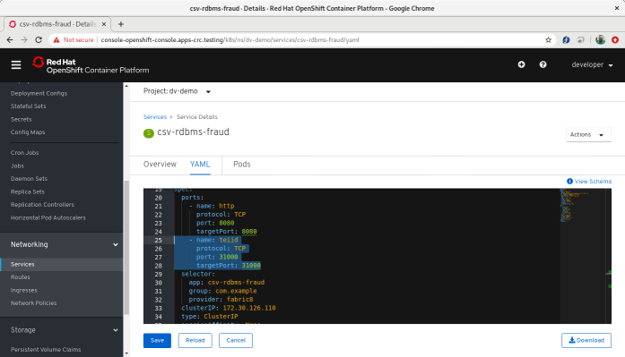

= CSV-RDBMS Virtual Database 
:experimental:
:toc:
:toclevels: 4

=== Introduction

This is a Spring Boot Data Virtualization application, targeted for Openshift deployment, which implements a Virtual Database (VDB) using 2 data sources:

* a MySQL database
* a CSV file

The VDB combines the credit fraus features residing on both the MySQL database (emaulatin historical data warehouse) and a CSV file (emulating recent data). The VDB can be accessed using JDBC using the URL:
----
jdbc:teiid:csvrdbmsdb.1@mm://127.0.0.1:31000
----
127.0.0.1 should be replaced by the VDB's service Cluster IP address.

=== MySQL Deployment
Follow the steps below to deploy and populate the MySQL database:

* use the Openshift console's Developer view to add a MySQL Database Service with persistence using Database name: mysqlsampledb; MySQL Connection Username: user; MySQL Connection Password: mypassword

* Assuming you are in the proejct hosting your mysql database and that the container name is 'mysql', Port forward to localhost using oc command:
----
oc port-forward $(oc get pods -o=jsonpath='{.items[0].metadata.name}' -l name=cmysql) 3306
----

* change to 'scripts' directory and issue the following command to populate the database:
----
mysql -u user -p mypassword -h 127.0.0.1 mysqlsampledb < mysql.sql
----

=== VDB Deployment
Make sure you are in the project hosting your VDB, follow the steps below to deploy and configure the VDB:

* change to the 'csv-rdbms-fraud' directory and change the IP address in 'src/main/resources/application.properties' entry to the MySQL service Cluster IP address:
----
spring.datasource.sampledb.jdbc-url=jdbc:mysql://172.30.71.208:3306/mysqlsampledb
---- 

* Deply Spring Boot VDB by issuing commands:
----
oc policy add-role-to-user view -z default
oc create configmap csv-rdbms-fraud --from-file=src/main/resources/application.properties
mvn clean -P openshift fabric8:deploy
----

* Add Teiid JDBC Service: From Openshift console 'Networks', select 'csv-rdbms-fraud' and click 'YAML'. Add entries under 'ports:':

----
    - name: teiid
      protocol: TCP
      port: 31000
      targetPort: 31000
----

Highlighted in screenshot below:

* From the Openshift console 'Storage->Persistence Volume Claim', create a persistence volume claim with: Persistent Volume Claim Name: csv-rdbms; Size: 2 Mi

* From the Openshift console 'Workloads->Deployment Config', select '
csv-rdbms-fraud'. Click 'Actions->Add Storage' selecting the following parameters: Use existing claim: csv-rdbms; Mount Path: /media

* Change to 'data-virtualization' directory and issue oc command to mount the csv file:
----
oc rsync resources $(oc get pods -o=jsonpath='{.items[0].metadata.name}' -l app=csv-rdbms-fraud):/media/
----

=== Accessing the VDB using JDBC
The VDB can be accessed using JDBC using the URL:
----
jdbc:teiid:csvrdbmsdb.1@mm://127.0.0.1:31000
----
127.0.0.1 should be replaced by the VDB's service Cluster IP address.

